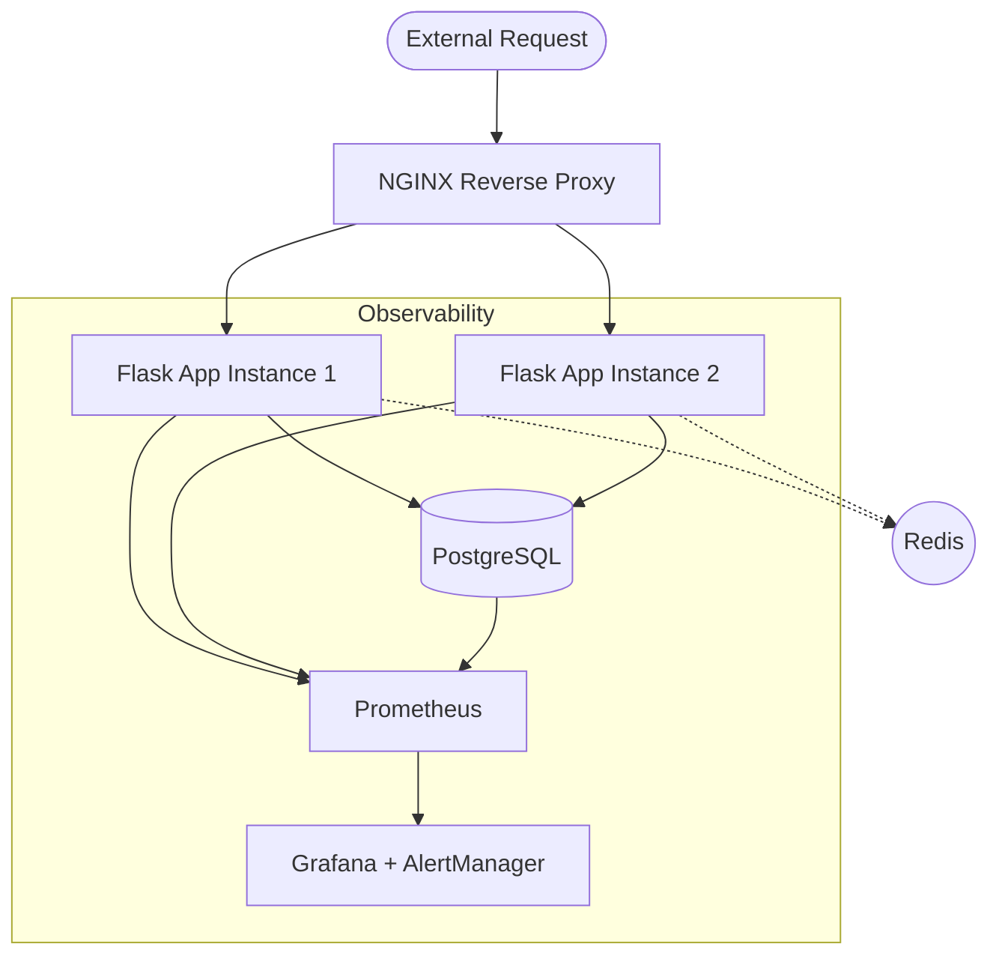

# Vybe 🔗

**Production-grade URL Shortener** built for resilience, observability, and scale. Engineered for the MLH Production Engineering Quest with full incident response and reliability testing.


---

## 🚀 Quick Start

Get Vybe up and running in 30 seconds:

```bash
git clone https://github.com/Invariants0/Vybe.git && cd Vybe
just dev-up
```

> [!NOTE]  
> Make sure you have [overmind](https://github.com/DarthSim/overmind) and [just](https://github.com/casey/just) installed
> <br/>
> Visit **[http://localhost](http://localhost)** to access the dashboard.  
> **API Docs:** [http://localhost/api/v1/docs](http://localhost/api/v1/docs)  
> **Monitoring:** Grafana at [http://localhost:3001](http://localhost:3001) (admin/admin)

---

## ✨ Features at a Glance

- **⚡ Blazing Fast:** 45ms P95 latency at 500 RPS.
- **🛡️ Built for Failure:** Resilient to DB/Cache outages and container crashes.
- **👁️ Full Visibility:** Prometheus metrics, Grafana dashboards, and structured JSON logs.
- **🧪 Battle Tested:** 7 verified failure scenarios and automated integration tests.
- **📖 Operator-First:** Comprehensive runbooks, architecture guides, and capacity plans.

---

## 🏗️ Architecture (Quick Overview)



---

## 📚 Documentation

<details>
<summary><b>👨‍💻 For Developers</b></summary>

Understand the codebase and start contributing:
1. [Quick Start Index](artifacts/documentation/INDEX.md) - Orientation (5m)
2. [Architecture Guide](artifacts/documentation/architecture.md) - Deep dive (15m)
3. [API Reference](artifacts/documentation/api.md) - All 18 endpoints
4. [Local Dev Setup](#-manual-setup) - Environment config

</details>

<details>
<summary><b>🛠️ For DevOps / SRE</b></summary>

Operational guidance for production:
1. [Deployment Guide](artifacts/documentation/deploy.md) - Local to Cloud
2. [Config Reference](artifacts/documentation/config.md) - Env var tuning
3. [Capacity Plan](artifacts/documentation/capacity-plan.md) - Scaling limits
4. [Runbooks](artifacts/documentation/runbooks.md) - Incident procedures

</details>

<details>
<summary><b>🚨 For On-Call Engineers</b></summary>

Fast response when things break:
1. [Incident Runbooks](artifacts/documentation/runbooks.md) - Step-by-step fixes
2. [Troubleshooting Guide](artifacts/documentation/troubleshooting.md) - Root cause diagnosis
3. [Alert Definitions](artifacts/documentation/runbooks.md#alerts) - What each alert means

</details>

<details>
<summary><b>📑 Complete Documentation Index</b></summary>

| Document | Audience | Time |
| :--- | :--- | :--- |
| [Architecture](artifacts/documentation/architecture.md) | Engineers | 40m |
| [API Reference](artifacts/documentation/api.md) | Devs | 20m |
| [Deployment](artifacts/documentation/deploy.md) | SRE | 30m |
| [Troubleshooting](artifacts/documentation/troubleshooting.md) | On-Call | 25m |
| [Runbooks](artifacts/documentation/runbooks.md) | On-Call | 30m |
| [Decision Log](artifacts/documentation/decision-log.md) | Architects | 20m |

</details>

---

## ⚙️ Setup & Operations

### 🛠️ Manual Development Setup

1. **Prepare Environment:**
   ```bash
   uv sync
   cp backend/.env.example backend/.env
   ```
2. **Start Dependencies:**
   ```bash
   docker compose up -d db redis
   ```
3. **Init & Run:**
   ```bash
   uv run python scripts/init_db.py
   uv run python run.py
   ```

> [!IMPORTANT]  
> Ensure your `.env` contains the correct database credentials. The system uses specific passwords for Redis and Grafana by default (see `docker-compose.yml`).

> [!TIP]  
> To optimize performance for 500+ RPS, ensure Redis is healthy and `REDIS_CACHE_ENABLED` is set to `true`.

<details>
<summary><b>📁 Project Structure</b></summary>

```
backend/       # Flask API, SQL Alchemy models, Business logic
frontend/      # Next.js Dashboard and UI
infra/         # Nginx configs, Dockerfiles
monitoring/    # Prometheus & Grafana provisioning
scripts/       # DB init, Chaos testing, Load testing
tests/         # Unit and Integration test suites
```

</details>

<details>
<summary><b>📊 Observability & Monitoring</b></summary>

Vybe tracks RED metrics (Rate, Errors, Duration) for every request.

| Alert | Trigger | Recovery Action |
| :--- | :--- | :--- |
| **Instance Down** | 0 healthy targets | Auto-failover by Nginx |
| **High Error Rate** | >5% failures | Log analysis via Grafana |
| **P95 Latency** | >1s duration | Scale app or check DB load |
| **DB Pool Exhaust** | >90% usage | Increase `DB_POOL_SIZE` |

</details>

<details>
<summary><b>🧪 Testing & Coverage</b></summary>

```bash
uv run pytest tests/ --cov=backend  # All tests
uv run pytest tests/unit/           # Unit only
```

> [!WARNING]  
> Current coverage is **45%**. Priority: Increase coverage for `url_service` and `auth` modules.

</details>

<details>
<summary><b>⚠️ Safety & Best Practices</b></summary>

> [!CAUTION]  
> Never perform manual `DELETE` operations on the PostgreSQL `urls` table in production. This causes cache inconsistency. Use the `SCRUB_DATA` API endpoint instead.

</details>

---

## 🏆 Quest Status (Tiers Complete)

- [x] **Bronze:** Architecture & Data Flow documented.
- [x] **Silver:** 45-min Deployment guide & Config reference complete.
- [x] **Gold:** 7 failure scenarios tested and documented in Runbooks.

**Incident Verification (Apr 5, 2026):**
Tested: *Database Down*, *CPU Spike*, *Redis Loss*, *High Error Rate*.
Result: **100% Resilience Success.**

---

## 🔮 Future Scope

- [ ] **Redis Cluster:** High availability for caching.
- [ ] **Read Replicas:** Scale to 2000+ RPS.
- [ ] **Rate Limiting:** Per-IP/User throttling.
- [ ] **Custom Domains:** Enterprise link support.

---

## ❓ FAQ

<details>
<summary>Is this production-grade?</summary>
Yes. It includes gracefully handling failures, health checks, connection pooling, and automated failover.
</details>

<details>
<summary>How do I test the resilience?</summary>
Run `bash scripts/chaos.sh` to simulate failures and watch Grafana alerts trigger.
</details>

---

## 📄 Support & License

- **Emergency?** Check [Runbooks](artifacts/documentation/runbooks.md).
- **Issues?** Raise a GitHub Issue.
- **License:** Apache 2.0 (Commercial use allowed).

<p align="center">
  <strong>Maintained for Production Performance (April 2026)</strong>
</p>
